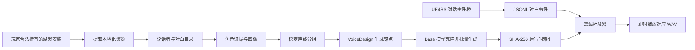

# WanderingSwordVoiceMod

《逸剑风云决》全离线 AI 配音 Mod 的技术实现。项目打通了“游戏对白提取 →
角色画像与声线规划 → 批量离线语音生成 → UE4SS 原生事件捕获 → 本地索引查表播放”
的完整链路。

> 本仓库包含技术代码、完整对白目录快照、完整角色注册表、完整角色画像和完整声线
> 规划。它不包含游戏 `.pak` 等原始资源、AI 配音、模型权重、UE4SS 或其他第三方
> 二进制文件，因此仍不是下载后即可游玩的完整 Mod。

## 参考实现成果

使用本仓库方案构建的社区版本包含：

- 849 个角色、群演与旁白声线组；
- 44,643 个独立对白任务，约 103 万字；
- 87,087 个“说话者 + 台词”精确索引；
- 84,159 个文本兜底索引，用于处理过场 UI 更新不同步；
- 主动交互、可跳过剧情过场、杂兵、神秘人、旁白及系统剧情提示；
- 全量预生成、断点续跑和玩家端即时播放；
- 1.00×～1.50× 保音高时间拉伸播放。

仓库已经包含上述对白目录、角色画像和声线规划；生成音频仍单独发布。

## 随仓库公开的数据成果

- `catalog/dialogue_catalog.jsonl`：44,644 条目录记录，其中 44,643 条可发声；
- `catalog/character_registry.json`：对白角色、显示名、别名与游戏元数据映射；
- `catalog/profiles/character_profiles.json`：1,007 个原始角色画像；
- `catalog/voice_plan.json`：849 个最终声线组；
- `catalog/voice_plan.csv`：便于人工查看的同版声线规划表。

这些文件按项目最终使用版本原样公开。校验值见
[`catalog/DATASET_SHA256.txt`](catalog/DATASET_SHA256.txt)。它们包含或衍生自游戏
内容，不适用本仓库代码的 MIT License，相关权利仍归各自权利人所有。

## 核心思路



运行时不使用 OCR，也不修改游戏 `.pak`。UE4SS Lua Mod 监听经过确认的游戏
对话控件，将说话者和台词写入 JSONL；播放器规范化文本、计算 SHA-256、查找
预生成 WAV 并播放。新台词出现时会中断上一句，避免画面和语音不同步。

## 仓库结构

```text
bridge/             TTS 推理、锚点生成、全量生成和运行时播放器
catalog/            本地化提取、对白目录、角色画像和声线规划
community_source/   无模型社区播放器、安装器和发布模板源码
config/             不含游戏人物的示例配置
docs/               架构、复现步骤、数据格式与合规说明
scripts/            环境检查、打包、覆盖率审计和服务器流水线
src/ue4ss/          UE4SS Lua 对话事件桥
tests/              不依赖游戏文件和模型的单元测试
tools/README.md      第三方工具获取与放置说明
```

## 快速开始

### 1. 克隆并建立环境

建议使用 Python 3.10 或 3.11。PyTorch 与 torchaudio 应根据服务器 CUDA 版本从
官方渠道安装，然后安装项目依赖：

```powershell
python -m pip install -r requirements.txt
python -m pip install -r requirements-catalog.txt
Copy-Item config\voice_profiles.example.json config\voice_profiles.json
```

模型、音频、游戏解包文件和其他中间数据均被 `.gitignore` 排除；上文列出的四个
最终数据成果是有意纳入仓库的例外。

### 2. 准备第三方工具

从原项目获取并自行放置：

- [repak](https://github.com/trumank/repak)：仅提取自己合法持有的游戏安装；
- [UE4SS](https://github.com/UE4SS-RE/RE-UE4SS)：运行时事件桥；
- [Qwen3-TTS](https://github.com/QwenLM/Qwen3-TTS)：声线设计和离线合成；
- UAssetGUI、umodel：仅在需要补充人物元数据或人工核对头像时使用。

具体目录见 [tools/README.md](tools/README.md)。仓库不重新分发这些二进制文件。

### 3. 执行数据与生成流水线

```powershell
$env:WS_GAME_ROOT = "D:\Path\To\Steam\steamapps\common\Wandering Sword"

python catalog\extract_localization.py --game-root $env:WS_GAME_ROOT
python catalog\build_catalog.py

# 可选：使用 DeepSeek 从官方描述和对白证据生成角色画像
$env:DEEPSEEK_API_KEY = "在本机环境变量中设置，不要写入文件"
python catalog\profile_characters.py

python catalog\build_voice_plan.py
python catalog\build_offline_jobs.py
python bridge\design_offline_anchors.py --batch-size 8
python bridge\synthesize_offline_dialogue.py --batch-size 20
python scripts\verify_generation_ready.py --require-complete
```

上述命令会产生游戏内容、画像、索引和 WAV，它们只应保存在本机，不应提交到
本仓库。完整步骤、输入文件和可选分支见 [复现指南](docs/REPRODUCTION.md)。

### 4. 安装事件桥并运行

将 `src/ue4ss/Mods/WanderingSwordVoiceProbe` 安装到游戏 UE4SS `Mods` 目录，并
在 `mods.txt` 中启用：

```text
WanderingSwordVoiceProbe : 1
```

开发环境可使用：

```powershell
python bridge\offline_runtime.py
```

面向普通玩家的无 Python 播放器与安装器位于 `community_source/`。构建完整社区
包还需要自行下载 UE4SS，并准备本地生成的 compact lookup 与 WAV。

## 为什么采用全量离线方案

实时 TTS 容易受到首句等待、显存占用、生成失控和帧率波动影响。全量离线方案把
成本放到一次性的生成阶段：

- 玩家端不加载模型；
- 播放延迟主要是文件查找和系统音频启动；
- 相同角色复用同一锚点，声音更一致；
- 生成可按 job ID 断点续跑；
- 索引、音频与游戏运行时解耦，便于增量修复。

## 文档

- [系统架构](docs/ARCHITECTURE.md)
- [从零复现](docs/REPRODUCTION.md)
- [数据格式](docs/DATA_FORMATS.md)
- [安全、版权与发布边界](docs/LEGAL_AND_SAFETY.md)
- [贡献指南](CONTRIBUTING.md)

## 安全与隐私

- API Key 只从环境变量读取；
- 不要提交 `.env`、日志、事件文件或生成结果；
- 不要在 issue 中粘贴完整游戏对白、游戏解包文件或个人密钥；
- 推送前运行 `python scripts/check_repository_hygiene.py`。

如果任何密钥曾进入 Git 历史，仅删除当前文件是不够的：应立即在服务商控制台
吊销并重新生成密钥，然后清理 Git 历史。

## 许可证与声明

本仓库原创代码采用 [MIT License](LICENSE)。许可证不覆盖游戏、游戏文本、生成
音频、模型、商标或第三方组件。详见 [NOTICE.md](NOTICE.md) 与
[合规说明](docs/LEGAL_AND_SAFETY.md)。

本项目是非官方社区作品，与游戏开发商、发行商、Qwen、UE4SS 或相关 API 服务商
无隶属、授权、赞助或背书关系。
